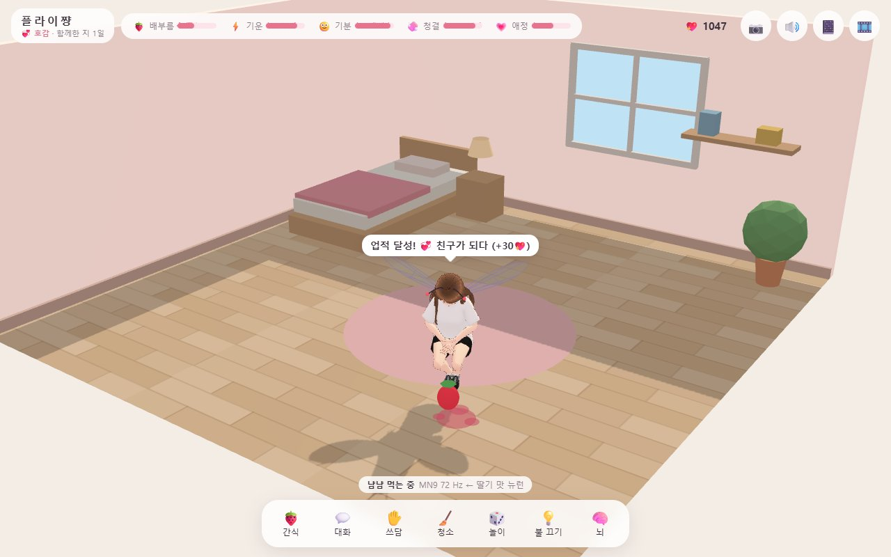
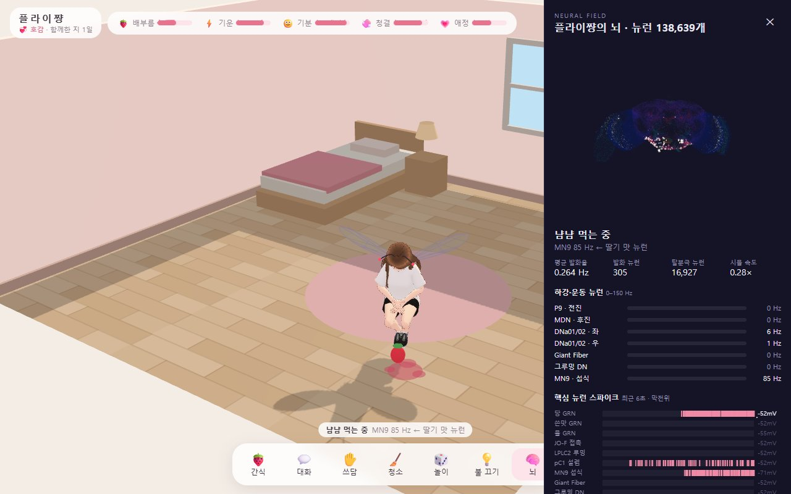
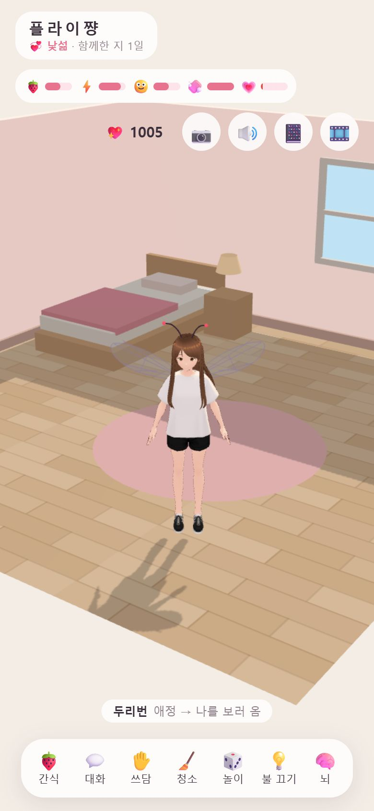
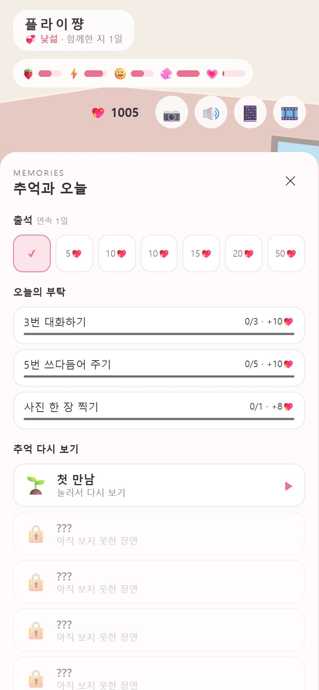
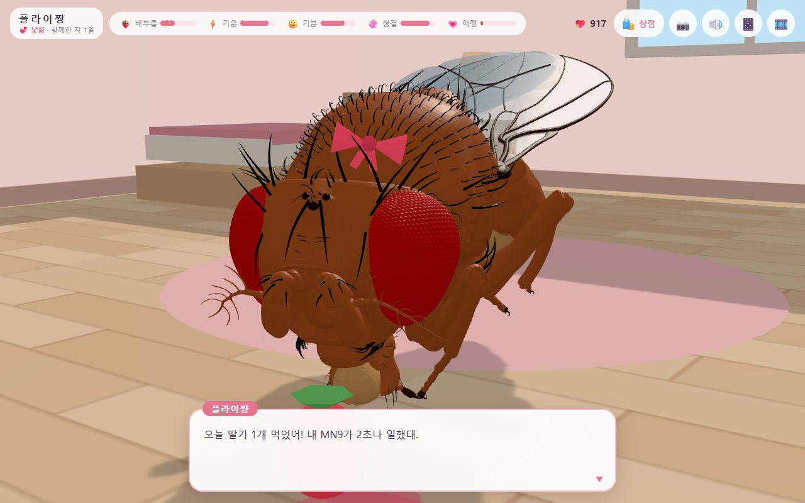
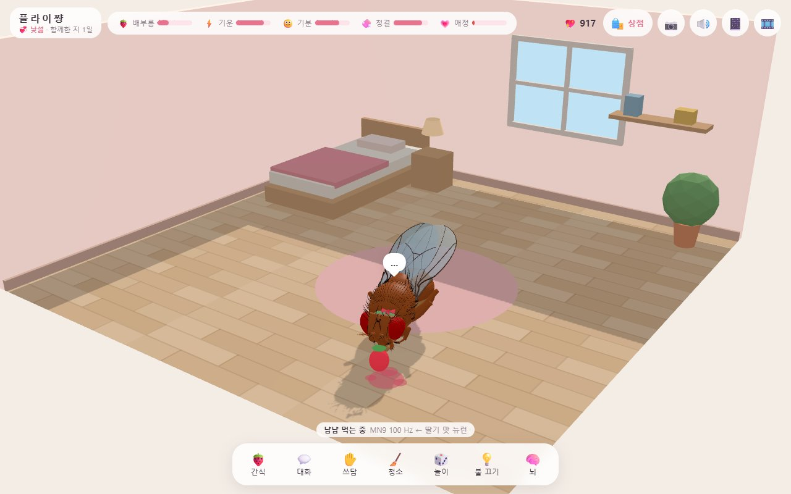
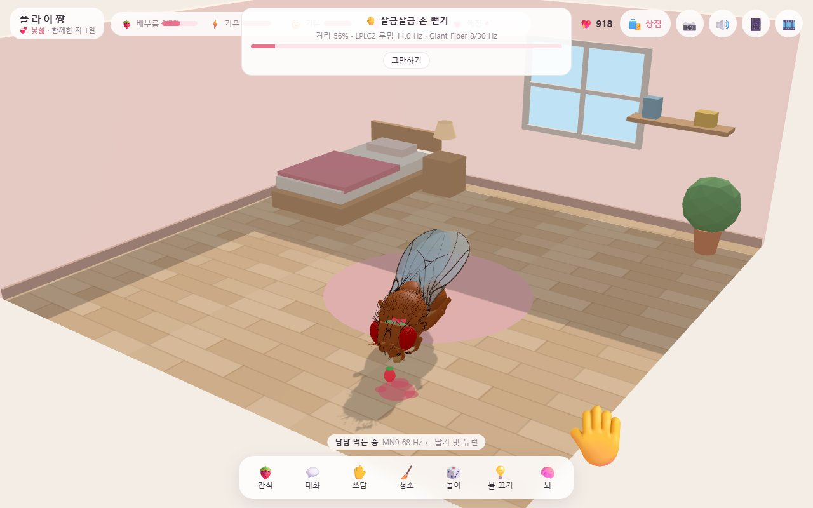
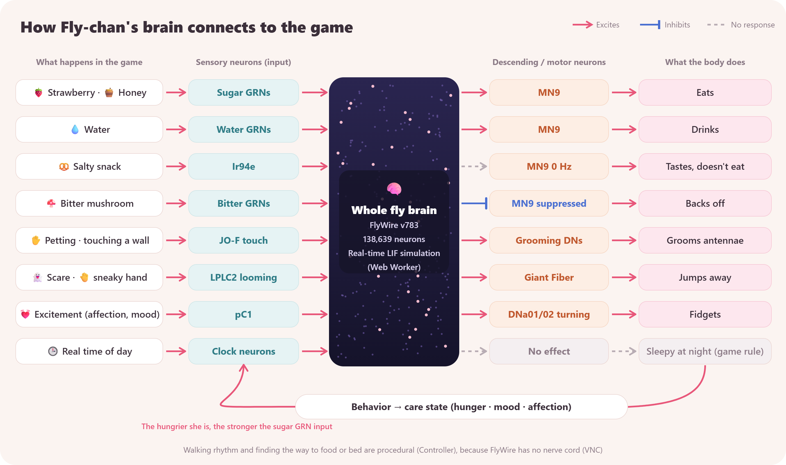

# Fly-chan (플라이쨩)

[한국어](README.md) | **English**

**A 3D virtual pet: a girl with a fruit fly's brain.**

Fly-chan runs the full adult fruit fly brain connectome (FlyWire v783, 138,639 neurons) as a leaky integrate-and-fire (LIF) network in your browser, in real time. Whether she eats the strawberry, jumps away in fright, or grooms her antennae is decided by the descending and motor neurons of that simulated brain, not by a script.

> **▶ Play now: https://fkfkfk0406.github.io/fly-chan/** (in your browser, no install. The first visit downloads about 100 MB of brain data.)
>
> The game is available in English and Korean. Pick a language on the first screen or at the bottom of the diary.



| Brain view | Mobile | Memories & today |
|---|---|---|
|  |  |  |

| Realistic fly avatar | Eating (proboscis extension) | Sneaky-hand mini-game |
|---|---|---|
|  |  |  |

## Features

**Care**
- Snacks, talk, petting, cleaning, lights. Fullness, energy, mood, cleanliness and affection change over time, including while the app is closed (up to 72 hours).
- Brain view: a point cloud of all neurons, descending/motor neuron firing rates, a spike raster of key neurons, and the cause of the current behavior.

**Relationship**
- Stranger → friend → crush → heart-fluttering → lover. Affection rises only a little per day, and advancing also needs enough days together and a good mood at that moment.
- Choice-based events at each stage, stage-specific conversations, and a name and nickname you choose at the first meeting.
- Leave her alone too long and she sulks with her back turned. Petting, favorite snacks, talking or a gift will win her back. She leaves you letters while you are away.

**Daily**
- Hearts accumulate while you are together and while you are away. Spend them on snacks, cosmetics (ribbon, scarf, plant, picture frame) and gifts.
- Daily check-in rewards, three daily requests, replays of past scenes, and a photo album.
- Diary, achievements, and photos (hung in the in-room frame).
- Looks: the default VRM girl, a **realistic fruit fly** (an anatomical 3D model whose 66 body segments move as joints; the brain's output drives tripod walking, foreleg grooming, proboscis extension and wing buzzing), or your own VRM file.

**Play**
- **Sneaky hand:** the approach speed of your hand becomes input to the real looming-detector neurons (LPLC2). Move too fast and the real Giant Fiber fires and she escapes. The closer you are, the scarier the same speed looks.
- **Strawberry catch:** catch strawberries for 20 seconds and dodge the mushrooms.
- A few easter eggs are hidden, too.

## How the brain connects to the game



Food preferences are not scripted either: the peak MN9 firing rate while eating each snack is recorded and shown in the diary as "tastes your brain told you".

## Running

### Web

To just play, open the [web version](https://fkfkfk0406.github.io/fly-chan/). To run it yourself:

```bash
npm install
python -m venv pipeline/.venv
pipeline/.venv/Scripts/python -m pip install pandas pyarrow numpy   # macOS/Linux: pipeline/.venv/bin/python
npm run data      # downloads ~140 MB of source data → ~91 MB of binaries in public/data/, plus the VRM
npm run dev       # http://localhost:5173
```

The brain data and VRM can also be downloaded directly from the [`data-v783` release](https://github.com/fkfkfk0406/fly-chan/releases/tag/data-v783) into `public/data/` and `public/models/`.

To try it on a phone, start with `npx vite --host` and open `http://<PC IP>:5173` on the same Wi-Fi.

### Desktop app (Windows)

A small always-available window that lives in the system tray, built with [Tauri](https://tauri.app) (requires [Rust](https://rustup.rs)).

```bash
npm run desktop         # dev run (uses public/data as is)
npm run desktop:build   # installer → src-tauri/target/release/bundle/nsis/
```

- The installer does not bundle the brain data or VRM. They are downloaded once (~104 MB) from the `data-v783` release on first launch.
- ✕ hides the window to the tray. The tray menu has always-on-top, start with Windows, and quit.
- While hidden, the brain simulation pauses. When you open it again, the elapsed time is applied to hunger and the other gauges.
- The installed app checks for updates at launch and every 6 hours, and restarts after updating. Your pet and the downloaded data are kept.

**Releasing a new version (maintainers)**

```bash
npm run release   # bumps package.json, commits, tags (v0.1.1 …) and pushes
```

Pushing the tag triggers GitHub Actions (`.github/workflows/release.yml`), which builds and signs the installer, uploads it to Releases, and publishes the `latest.json` read by the updater. The same tag triggers `.github/workflows/pages.yml`, which redeploys the web version to GitHub Pages (the brain data and VRM are pulled from the `RELEASE_TAG` release).
- Signing key: the private key is the repository secret `TAURI_SIGNING_PRIVATE_KEY`; the public key is in `src-tauri/tauri.conf.json`. If the private key is lost, installed apps can no longer receive updates.
- To change the brain data, upload it under a new tag (e.g. `data-v784`) as a **prerelease** and update `RELEASE_TAG` in `src/util/assets.ts`. Prereleases keep the updater's `releases/latest` lookup pointing at app releases.

### Developer options

| URL parameter | Effect |
|---|---|
| `?time=60` | Care time runs 60× faster (1 minute = 1 hour) |
| `?hearts=999` | Start with 999 hearts |
| `?dt=0.25` | Integration step (default 0.5 ms) |
| `?adapt=300:1` | Enable spike-frequency adaptation (τw 300 ms, 1 mV per spike) |

- `npm test`: LIF engine tests (synthetic networks and paper results reproduced on the real connectome), plus care, script, daily and sulking tests
- `npm run probe -- sugar:150`: stimulate a sensory group and print the most active descending/motor neurons
- `scripts/`: speed benchmark (`bench`), taste safety (`taste_probe`, `snack-safety`), pC1/clock/looming calibration (`pc1-probe`, `clock-probe`, `loom-probe`), adaptation (`adapt`)

Shortcuts: F feed, T talk, P pet, C clean, L lights, B brain view, Space/Enter advance dialogue, Esc close panel

## Project layout

| Path | Role |
|---|---|
| `src/sim/` | LIF engine (`lif-engine.ts`), connectome loading and the simulation loop (Web Worker) |
| `src/world/` | Room and snack definitions, sensory input mapping, circadian clock |
| `src/behavior/Controller.ts` | Descending neuron firing rates → behavior (procedural stand-in for the VNC) |
| `src/care/` | Care state, relationship stages, hearts, shop, achievements, daily check-in and requests |
| `src/story/` | Dialogue scripts, scene director, Korean particle handling, letters and sulking, memories, easter eggs |
| `src/body/` | VRM rig, realistic fly avatar (`RealFlyAvatar.ts`), animation, 3D room |
| `src/ui/`, `src/brain/`, `src/fx/` | Dialogue box and mini-games, brain visualization and raster, particles and sound effects |
| `src-tauri/` | Desktop app (window and tray) |
| `pipeline/` | Source data → `public/data` binaries and neuron groups; flybody model → `public/fly` |
| `docs/PROGRESS.md` | Progress notes and next steps (Korean) |

## Brain model

Same equations and parameters as the Brian2 model of Shiu et al. 2024 (Nature):
- `dv/dt = (v0 − v + g)/τm`, `dg/dt = −g/τs`, 0.275 mV per synapse, 1.8 ms delay, 2.2 ms refractory period
- Exact integration, updating only neurons that have left rest, so it runs close to real time in a browser.

Reproduced results covered by tests (`tests/lif-engine.test.ts`): sugar GRNs → MN9, bitter co-stimulation → MN9 suppression, JO-F → grooming DNs, LPLC2 → Giant Fiber, silence without input.

## Limitations and design choices

- **There is no VNC.** FlyWire covers the brain only, so the walking rhythm, wall and bed avoidance, and drives toward food, bed or the user are procedural. Feeding, grooming and jumping are decided by the brain's output, and forward/backward/turning DN rates are added to speed and turning. The brain panel's "cause" line shows which is which.
- **No olfaction.** Stimulating vinegar-responsive ORNs at only 10 Hz leaves about 10,000 neurons firing after the stimulus ends. The cause is not Kenyon cells but antennal lobe local neurons (ALLNs), whose neurotransmitter predictions have a mean confidence of only 0.46, so many inhibitory neurons enter the model as excitatory (`scripts/persist.ts`).
- **One taste at a time.** Two tastes at once (especially Ir94e + bitter) cause runaway activity, so only the nearest snack touching the mouth is stimulated. Water GRNs are driven at 200 Hz and Ir94e at 100 Hz.
- **Adaptation is optional.** An adaptation current (not in the original model) can be enabled, but strong enough adaptation to stop runaway activity also nearly abolishes feeding, so it is off by default (`scripts/adapt.ts`).

  | Setting | MN9 during 3 s of sugar at 150 Hz | Spikes 300–600 ms after odor offset |
  |---|---|---|
  | No adaptation | 112 → 92 Hz | 262,413 |
  | τw 300 ms, b 1 mV | 44 → 30 Hz | 85,090 |
  | τw 500 ms, b 2 mV | 16 → 4 Hz | 0 |

- **pC1 and clock neurons:** the app's sensory inputs do not activate pC1, so it is driven directly by the excitement value. Clock neurons do not affect descending neurons, so they are display only; being sleepy at night is a game rule.
- **dt 0.5 ms** is coarser than Brian2's default (0.1 ms), but the reproduction tests pass at both 0.25 and 0.5 ms. When tens of thousands of neurons fire at once the simulation falls behind real time, and the world slows down by the same factor.

## Credits

- **FlyWire connectome v783:** Dorkenwald et al. 2024, Schlegel et al. 2024 (Nature). Connectivity from [philshiu/Drosophila_brain_model](https://github.com/philshiu/Drosophila_brain_model); annotations and coordinates from [flyconnectome/flywire_annotations](https://github.com/flyconnectome/flywire_annotations).
- **LIF model:** Shiu et al. 2024, *A Drosophila computational brain model reveals sensorimotor processing*, Nature.
- **Fruit fly 3D model:** [TuragaLab/flybody](https://github.com/TuragaLab/flybody) (Vaxenburg et al., Apache License 2.0), converted to GLB and joint data with `pipeline/build_fly_model.py` (see `public/fly/NOTICE.txt`).
- **Character:** pixiv `VRM1_Constraint_Twist_Sample` (VRM Public License 1.0: use, commercial use, modification and redistribution allowed). Any VRM can replace `public/models/fly-chan.vrm`; if it fails to load, a simple shape doll is used instead.
